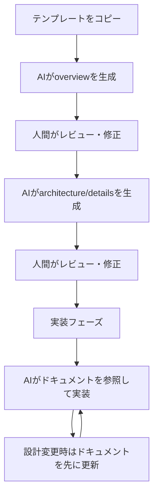

# 設計思想

templarc-docs テンプレートの設計方針と、各制約を採用した根拠を記述する。

---

## 基本方針: AIファースト・人間も読める

AIエージェントがドキュメントを生成・読解・更新する前提で設計している。人間の可読性は制約として維持するが、最適化の優先順位はAIが上位である。

| 優先順位 | 対象 | 理由 |
|----------|------|------|
| 1 | AI処理効率 | ドキュメントの生成・更新・参照の主体がAIに移行している |
| 2 | 人間の可読性 | レビュー・意思決定は人間が行う |
| 3 | 保守性 | 変更箇所の特定と差分レビューを容易にする |

---

## 段階的開示の設計

### 構造

```
01-overview（何を・なぜ） → 02-architecture（どう構成） → 03-details（具体仕様）
```

### 根拠

- AIがプロジェクト全体を把握する際、全ファイルを読む必要がない。overviewだけで概要判断が可能
- 人間も目的に応じて読む深さを選べる（初見→overview、実装→details）
- 各レベルのファイルが独立してレビュー・更新できる

---

## 制約の設計根拠

### 分量制限（200行/50行/60文字）

| 制約 | 根拠 |
|------|------|
| 1ファイル200行 | LLMのコンテキストウィンドウを節約し、1回の読み込みで全体把握可能にする |
| 1セクション50行 | スクロールなしで視認可能な範囲。AI・人間とも1チャンクとして処理しやすい |
| 1文60文字 | 構文解析の精度が上がる。長文は係り受けの曖昧性が増す |

### 曖昧表現の制御

AIは曖昧な表現を確率的に解釈する。解釈のばらつきを減らすため、曖昧度の高い表現を制限する。

- 「適切に」→ AIはコンテキストに応じて異なる解釈をする。具体値に置き換えれば一意に解釈される
- 「など」→ 列挙が不完全だとAIは推測で補完する。全量列挙すれば推測が不要になる

### YAML Front Matter

AIがファイルを開かずに内容を判断するためのメタデータ層である。

- `ai_summary`: ファイル選択の判断に使用。全ファイルの本文を読むコストを削減する
- `depends_on`: ファイル間の依存関係グラフをAIが構築できる
- `tags`: 関連ファイルの検索に使用する

### 自己完結性

AIは会話コンテキスト外のファイルを暗黙的に参照できない。各ファイルが単体で理解可能であれば、AIは必要なファイルだけを読み込んで正確に応答できる。

### DRY原則（概要重複許容・詳細重複禁止）

- 概要の重複を許容する理由: 自己完結性のため。AIが参照先を追加で読み込む必要がなくなる
- 詳細の重複を禁止する理由: 更新時の不整合リスク。1箇所を変更したとき他の箇所が古いまま残る

---

## 既存手法からの発展

このテンプレートは既存フレームワークの着想を取り入れつつ、AI時代のドキュメント管理に適応させた設計である。

| 着想元 | 取り入れた要素 | 発展させた点 |
|--------|----------------|--------------|
| arc42 | 段階的なセクション構造 | AI処理を前提とした分量制限とメタデータ層を追加 |
| Diátaxis | 読者の目的による分類 | 4分類ではなく3段階の深度（overview/architecture/details）に簡略化 |
| ADR | 決定記録フォーマット | そのまま採用 |
| Conventional Commits | コミットメッセージ規約 | ブランチ命名・CHANGELOG連携まで拡張 |

---

## 想定ワークフロー



| フェーズ | 主体 | 作業内容 |
|----------|------|----------|
| 初期生成 | AI | テンプレートに沿ってドラフトを生成 |
| レビュー | 人間 | 内容の正確性・方針の妥当性を確認 |
| 実装参照 | AI | ドキュメントをコンテキストとして実装コードを生成 |
| 保守更新 | AI + 人間 | 設計変更をドキュメントに反映し、レビューを経て確定 |
