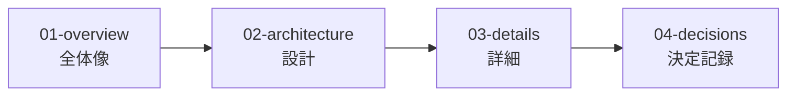

# templarc-docs

設計ドキュメントテンプレート - Design Document Template

## 概要

templarc-docs は、ソフトウェアプロジェクトの設計ドキュメントを作成するためのテンプレートである。

### 特徴

- **AIファースト**: YAML Front Matter、構造化メタデータ、明確な構造でAIが理解・処理しやすい
- **人間も読める**: 段階的開示（概要→詳細）、分量制限、視覚化で可読性を確保
- **GitHub特化**: Issue/PRテンプレート、Markdown形式
- **汎用性**: あらゆるプロジェクトで使用可能

## 構造

```
design/
├── 00-index.md              # 設計ドキュメントの目次
├── 00-getting-started.md     # 導入手順（はじめに）
├── 00-template-guide.md      # どこに何を書くか
├── 00-writing-guide.md      # 記載規範（文章品質）
├── 00-format-guide.md       # フォーマット規範（構造・メタ情報）
├── 00-git-guide.md          # Git規範
├── 01-overview/             # 基本（全体像）
│   ├── summary.md
│   ├── goals.md
│   └── scope.md
├── 02-architecture/         # 設計（中間）
│   ├── context.md
│   ├── structure.md
│   └── tech-stack.md
├── 03-details/              # 詳細
│   ├── data-model.md
│   ├── api.md
│   ├── ui.md
│   └── flows.md
├── 04-decisions/            # 決定記録（ADR）
│   └── 0001-template.md
└── 99-appendix/
    └── glossary.md          # 用語集

docs/
├── 00-index.md              # 利用者向けドキュメントの目次
├── 00-user-docs-guide.md     # 利用者向けドキュメント規範
├── quickstart.md
├── how-to.md
├── reference.md
├── troubleshooting.md
└── faq.md
```

## 使い方

### 1. テンプレートとして使用

```bash
gh repo create my-project-docs --template krtw00/templarc-docs
```

### 2. 手動でコピー

1. このリポジトリをクローン
2. `design/` ディレクトリを自分のプロジェクトにコピー
3. 利用者向けドキュメントが必要な場合は `docs/` もコピー
4. 各テンプレートの `{プレースホルダー}` を実際の内容に置き換え

導入後は、以下を参照。

- [design/00-getting-started.md](design/00-getting-started.md) - 導入手順と運用の最小ルール
- [design/00-template-guide.md](design/00-template-guide.md) - どこに何を書くか
- [docs/00-index.md](docs/00-index.md) - 利用者向けドキュメントの目次

## 読み方



| レベル | 目的 |
|--------|------|
| **01-overview** | 何を作るか、なぜ作るか |
| **02-architecture** | どう構成するか |
| **03-details** | 具体的な仕様 |
| **04-decisions** | なぜその選択をしたか |

## 記載規範

設計ドキュメントは [design/00-writing-guide.md](design/00-writing-guide.md) を参照。
利用者向けドキュメントは [docs/00-user-docs-guide.md](docs/00-user-docs-guide.md) を参照。

### 主なルール

| カテゴリ | ルール |
|----------|--------|
| 基本原則 | コード禁止、図の積極活用、What/Why優先 |
| 分量制限 | 1ファイル200行、1セクション50行、1文60文字 |
| 文章品質 | 1文1情報、主語明示、曖昧表現の制御 |
| 自己完結性 | 略称定義、暗黙知排除、参照時の要約 |
| 冗長性排除 | DRY原則、フィラー禁止、装飾語禁止 |
| メタデータ | YAML Front Matter（AI用）+ 引用ブロック（人間用） |

## ライセンス

MIT License
