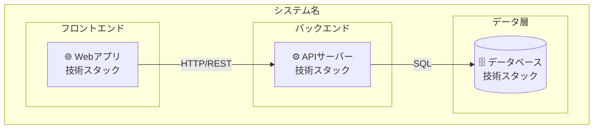

---
depends_on:
  - ./context.md
tags: [architecture, c4, container, components]
ai_summary: "主要コンポーネントの構成・責務・通信方式をC4 Container図で定義"
---

# 主要コンポーネント構成

> Status: Draft
> 最終更新: YYYY-MM-DD

本ドキュメントは、システムの主要コンポーネントとその関係を定義する（C4 Container相当）。

---

## コンポーネント構成図

<!-- システム内部の主要コンポーネント -->



---

## コンポーネント一覧

| コンポーネント | 種別 | 責務 | 技術 |
|----------------|------|------|------|
| {コンポーネント1} | {種別} | {責務} | {技術} |
| {コンポーネント2} | {種別} | {責務} | {技術} |
| {コンポーネント3} | {種別} | {責務} | {技術} |

---

## コンポーネント詳細

### {コンポーネント1}

| 項目 | 内容 |
|------|------|
| 責務 | {このコンポーネントの責務} |
| 技術 | {使用技術} |
| 入力 | {受け取るデータ・リクエスト} |
| 出力 | {返すデータ・レスポンス} |
| 依存 | {依存するコンポーネント} |

### {コンポーネント2}

| 項目 | 内容 |
|------|------|
| 責務 | {このコンポーネントの責務} |
| 技術 | {使用技術} |
| 入力 | {受け取るデータ・リクエスト} |
| 出力 | {返すデータ・レスポンス} |
| 依存 | {依存するコンポーネント} |

---

## コンポーネント間通信

| 送信元 | 送信先 | プロトコル | 内容 |
|--------|--------|------------|------|
| {コンポーネントA} | {コンポーネントB} | {HTTP/gRPC/etc} | {通信内容} |
| {コンポーネントB} | {コンポーネントC} | {HTTP/gRPC/etc} | {通信内容} |

---

## ディレクトリ構成

<!-- プロジェクトのディレクトリ構造 -->

```
project/
├── src/
│   ├── {ディレクトリ1}/    # {説明}
│   ├── {ディレクトリ2}/    # {説明}
│   └── {ディレクトリ3}/    # {説明}
├── tests/
├── design/                # 設計ドキュメント
├── docs/                  # 利用者向けドキュメント
└── ...
```

---

## 関連ドキュメント

- [システム境界・外部連携](./context.md) - C4 Context図と外部システム定義
- [技術スタック](./tech-stack.md) - 技術選定と選定理由
- [データモデル](../03-details/data-model.md) - エンティティ定義とER図
- [API設計](../03-details/api.md) - APIエンドポイント仕様
- [UI設計](../03-details/ui.md) - 画面一覧と画面遷移
- [主要フロー](../03-details/flows.md) - 業務フローのシーケンス図
