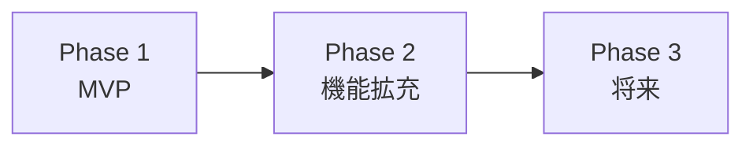

# スコープ・対象外

> Status: Draft
> 最終更新: YYYY-MM-DD

本ドキュメントは、プロジェクトのスコープ（範囲）を明確にする。

---

## スコープ定義

### 対象範囲

<!-- 何を作るか -->

| カテゴリ | 対象 | 説明 |
|----------|------|------|
| 機能 | {機能1} | {説明} |
| 機能 | {機能2} | {説明} |
| ユーザー | {ユーザー種別} | {説明} |
| プラットフォーム | {対象環境} | {説明} |

### 対象外

<!-- 明示的に対象外とするもの -->

| カテゴリ | 対象外 | 理由 |
|----------|--------|------|
| 機能 | {機能X} | {なぜ対象外か} |
| ユーザー | {ユーザーY} | {なぜ対象外か} |
| プラットフォーム | {環境Z} | {なぜ対象外か} |

---

## フェーズ分け

<!-- 段階的にリリースする場合 -->

### Phase 1: MVP

| 機能 | 説明 |
|------|------|
| {機能1} | {説明} |
| {機能2} | {説明} |

### Phase 2: 機能拡充

| 機能 | 説明 |
|------|------|
| {機能3} | {説明} |
| {機能4} | {説明} |

### Phase 3以降（将来検討）

| 機能 | 説明 |
|------|------|
| {機能5} | {説明} |

---

## 前提条件

<!-- プロジェクトの前提となる条件 -->

| 前提 | 説明 |
|------|------|
| {前提1} | {説明} |
| {前提2} | {説明} |

---

## 制約事項

<!-- プロジェクトに課せられた制約 -->

| 制約 | 種別 | 説明 |
|------|------|------|
| {制約1} | 技術 | {説明} |
| {制約2} | ビジネス | {説明} |
| {制約3} | リソース | {説明} |

---

## 関連ドキュメント

- [summary.md](./summary.md) - プロジェクト概要
- [goals.md](./goals.md) - 目的・解決する課題
