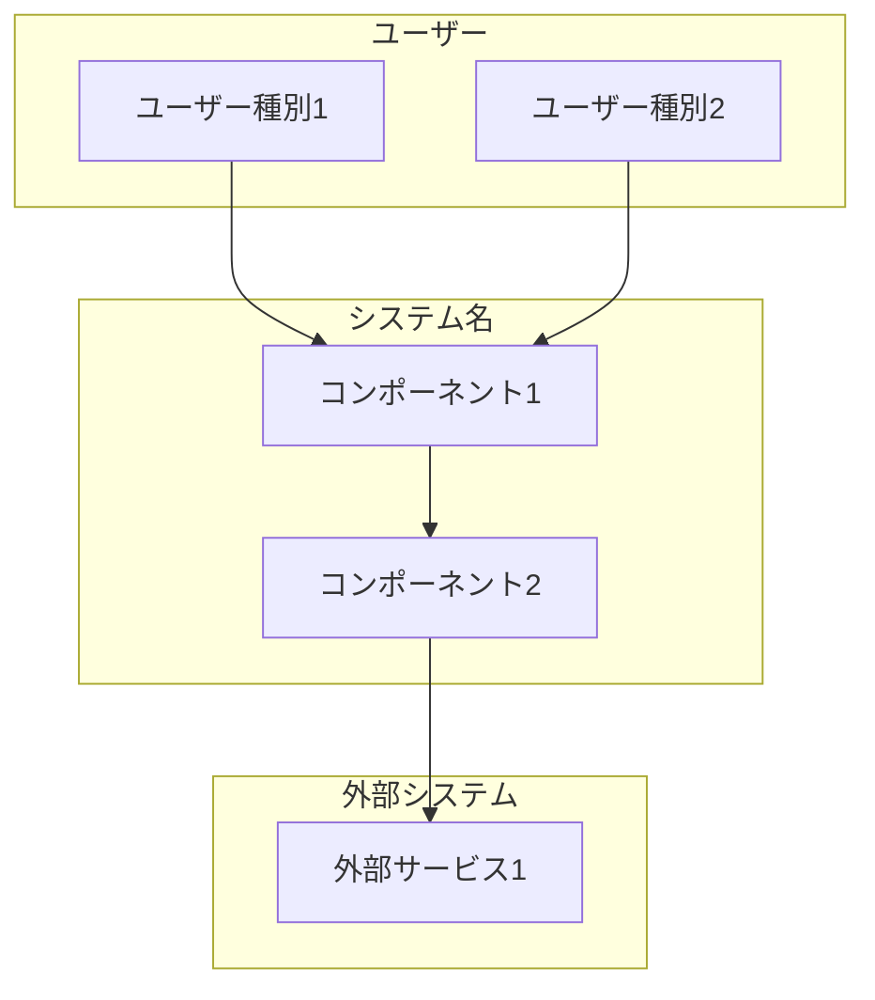

# プロジェクト概要

> Status: Draft
> 最終更新: YYYY-MM-DD

本ドキュメントは、プロジェクト全体を1枚で把握するための概要を記載する。

---

## 一言で言うと

<!-- 1-2文でプロジェクトを説明 -->

{プロジェクト名}は、{対象ユーザー}のための{主要機能}を提供する{プロダクト種別}である。

---

## 背景

<!-- なぜこのプロジェクトが必要なのか -->

| 項目 | 内容 |
|------|------|
| 現状の課題 | {現在の問題点} |
| 解決アプローチ | {どう解決するか} |

---

## 主要機能

<!-- 3-5個程度の主要機能 -->

| 機能 | 説明 |
|------|------|
| {機能1} | {説明} |
| {機能2} | {説明} |
| {機能3} | {説明} |

---

## 対象ユーザー

<!-- 誰のためのプロダクトか -->

| ユーザー種別 | 説明 | 主な利用シーン |
|--------------|------|----------------|
| {ユーザー1} | {説明} | {シーン} |
| {ユーザー2} | {説明} | {シーン} |

---

## システム概観

<!-- 全体像を示す図 -->

---

## 関連ドキュメント

- [goals.md](./goals.md) - 目的・解決する課題
- [scope.md](./scope.md) - スコープ・対象外
- [context.md](../02-architecture/context.md) - システム境界の詳細
