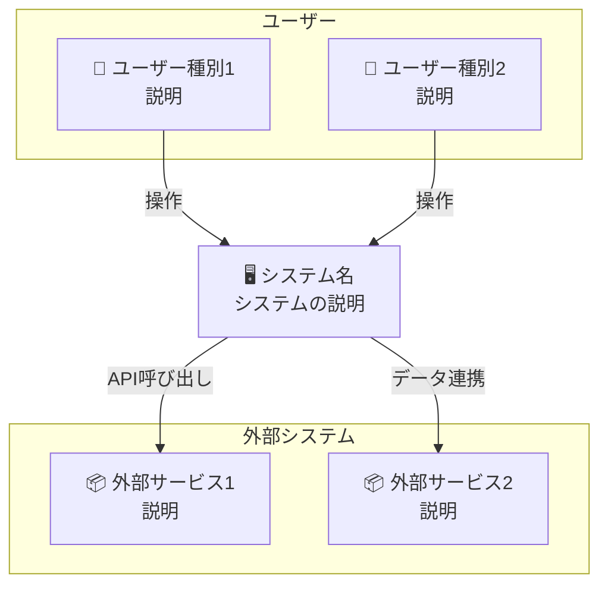

---
depends_on:
  - ../01-overview/summary.md
tags: [architecture, c4, context, boundary]
ai_summary: "システム境界と外部システム連携をC4 Context図で定義"
---

# システム境界・外部連携

> Status: Draft
> 最終更新: YYYY-MM-DD

本ドキュメントは、システムの境界と外部システムとの連携を定義する（C4 Context相当）。

---

## システムコンテキスト図

<!-- システム全体を外から見た図 -->

---

## アクター定義

<!-- システムを利用するユーザー・システム -->

| アクター | 種別 | 説明 | 主な操作 |
|----------|------|------|----------|
| {ユーザー1} | 人間 | {説明} | {操作内容} |
| {ユーザー2} | 人間 | {説明} | {操作内容} |
| {システム1} | 外部システム | {説明} | {連携内容} |

---

## 外部システム連携

### {外部システム1}

| 項目 | 内容 |
|------|------|
| 概要 | {何のためのシステムか} |
| 連携方式 | {REST API / Webhook / ファイル連携 等} |
| 連携データ | {やり取りするデータ} |
| 連携頻度 | {リアルタイム / バッチ / イベント駆動} |
| 依存度 | {必須 / オプション} |

### {外部システム2}

| 項目 | 内容 |
|------|------|
| 概要 | {何のためのシステムか} |
| 連携方式 | {REST API / Webhook / ファイル連携 等} |
| 連携データ | {やり取りするデータ} |
| 連携頻度 | {リアルタイム / バッチ / イベント駆動} |
| 依存度 | {必須 / オプション} |

---

## システム境界

### 内部（本システムの責務）

| 責務 | 説明 |
|------|------|
| {責務1} | {説明} |
| {責務2} | {説明} |

### 外部（本システムの責務外）

| 項目 | 担当 | 説明 |
|------|------|------|
| {項目1} | {外部システム名} | {説明} |
| {項目2} | {外部システム名} | {説明} |

---

## 関連ドキュメント

- [summary.md](../01-overview/summary.md) - プロジェクト概要
- [structure.md](./structure.md) - 主要コンポーネント構成
