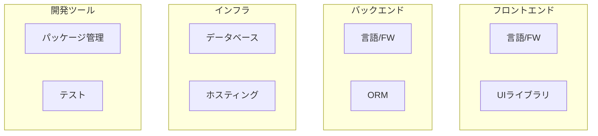

# 技術スタック

> Status: Draft
> 最終更新: YYYY-MM-DD

本ドキュメントは、プロジェクトで使用する技術スタックとその選定理由を記載する。

---

## 技術スタック概要

---

## 技術スタック一覧

### 言語・フレームワーク

| カテゴリ | 技術 | バージョン | 用途 |
|----------|------|------------|------|
| 言語 | {言語} | {バージョン} | {用途} |
| フレームワーク | {FW} | {バージョン} | {用途} |
| ランタイム | {ランタイム} | {バージョン} | {用途} |

### データベース・ストレージ

| 技術 | バージョン | 用途 |
|------|------------|------|
| {DB} | {バージョン} | {用途} |
| {ストレージ} | - | {用途} |

### インフラ・ホスティング

| 技術 | 用途 |
|------|------|
| {サービス} | {用途} |

### 開発ツール

| カテゴリ | 技術 | 用途 |
|----------|------|------|
| パッケージ管理 | {ツール} | {用途} |
| リンター | {ツール} | {用途} |
| フォーマッター | {ツール} | {用途} |
| テスト | {ツール} | {用途} |

---

## 技術選定理由

### {技術1}

| 項目 | 内容 |
|------|------|
| 選定理由 | {なぜこの技術を選んだか} |
| 代替候補 | {検討した他の選択肢} |
| 不採用理由 | {代替候補を選ばなかった理由} |

### {技術2}

| 項目 | 内容 |
|------|------|
| 選定理由 | {なぜこの技術を選んだか} |
| 代替候補 | {検討した他の選択肢} |
| 不採用理由 | {代替候補を選ばなかった理由} |

---

## バージョン管理方針

| 項目 | 方針 |
|------|------|
| メジャーバージョン | {方針：例）LTSに追従} |
| マイナーバージョン | {方針：例）セキュリティパッチは即時適用} |
| 依存関係更新 | {方針：例）月次で確認} |

---

## 関連ドキュメント

- [structure.md](./structure.md) - 主要コンポーネント構成
- [04-decisions/](../04-decisions/) - 技術選定のADR
