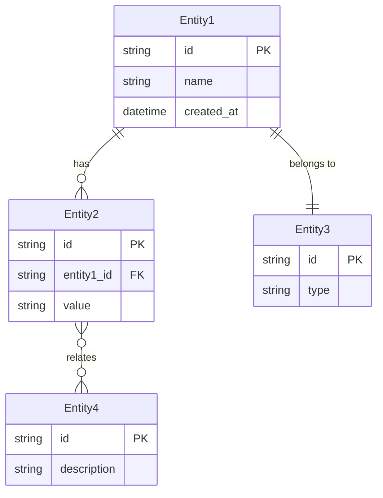
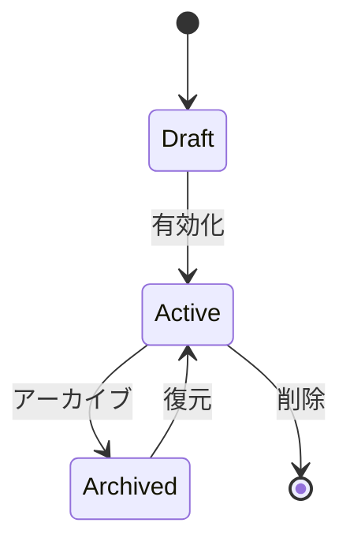

# データモデル

> Status: Draft
> 最終更新: YYYY-MM-DD

本ドキュメントは、システムのデータモデルを定義する。

---

## ER図

<!-- エンティティ間の関係 -->

---

## エンティティ一覧

| エンティティ | 説明 | 主キー |
|--------------|------|--------|
| {Entity1} | {説明} | {PK} |
| {Entity2} | {説明} | {PK} |
| {Entity3} | {説明} | {PK} |

---

## エンティティ詳細

### {Entity1}

| カラム | 型 | 必須 | 説明 |
|--------|-----|------|------|
| id | string | ○ | 一意識別子 |
| name | string | ○ | {説明} |
| description | string | - | {説明} |
| status | enum | ○ | {説明} |
| created_at | datetime | ○ | 作成日時 |
| updated_at | datetime | ○ | 更新日時 |

#### ステータス遷移

### {Entity2}

| カラム | 型 | 必須 | 説明 |
|--------|-----|------|------|
| id | string | ○ | 一意識別子 |
| entity1_id | string | ○ | Entity1への外部キー |
| value | string | ○ | {説明} |
| created_at | datetime | ○ | 作成日時 |

---

## リレーション

| 親 | 子 | 関係 | 説明 |
|-----|-----|------|------|
| Entity1 | Entity2 | 1:N | {説明} |
| Entity1 | Entity3 | 1:1 | {説明} |
| Entity2 | Entity4 | N:M | {説明} |

---

## インデックス

| テーブル | カラム | 種別 | 目的 |
|----------|--------|------|------|
| {Entity1} | id | PRIMARY | 主キー |
| {Entity1} | status | INDEX | ステータス検索 |
| {Entity2} | entity1_id | INDEX | 外部キー検索 |

---

## 関連ドキュメント

- [structure.md](../02-architecture/structure.md) - 主要コンポーネント構成
- [api.md](./api.md) - API設計
