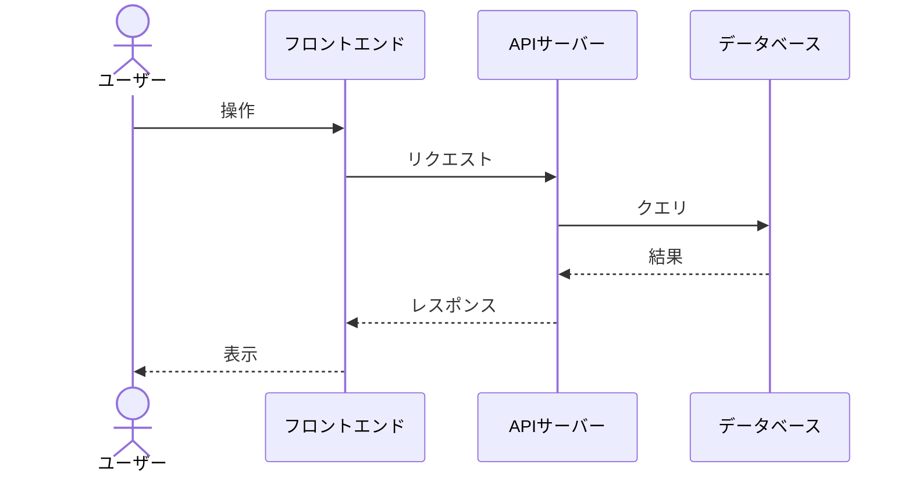
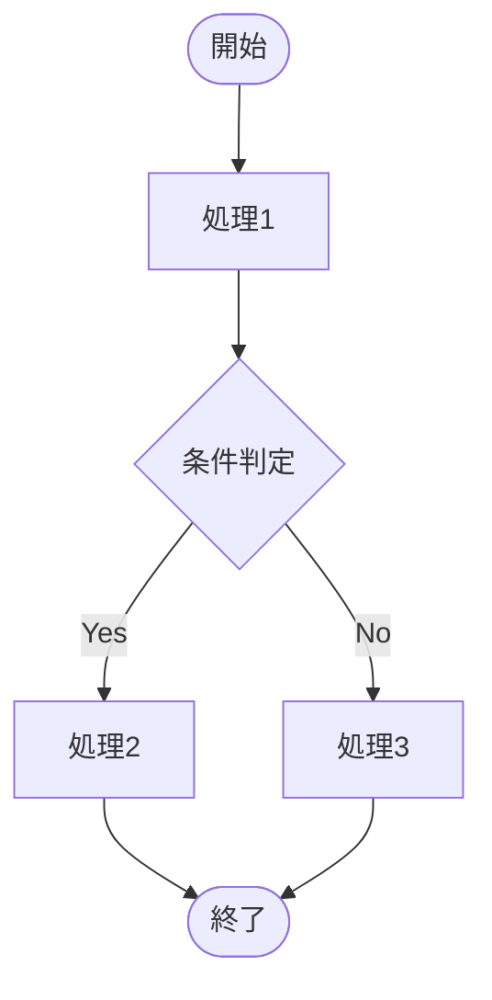

# 主要フロー

> Status: Draft
> 最終更新: YYYY-MM-DD

本ドキュメントは、システムの主要な処理フローを定義する。

---

## フロー一覧

| フローID | フロー名 | 説明 |
|----------|----------|------|
| F001 | {フロー名1} | {説明} |
| F002 | {フロー名2} | {説明} |
| F003 | {フロー名3} | {説明} |

---

## フロー詳細

### F001: {フロー名1}

| 項目 | 内容 |
|------|------|
| 概要 | {このフローの概要} |
| トリガー | {何がきっかけで開始するか} |
| アクター | {誰・何が実行するか} |
| 前提条件 | {フロー開始前に満たすべき条件} |
| 事後条件 | {フロー完了後の状態} |

#### シーケンス図

#### 処理ステップ

| # | 処理 | 担当 | 説明 |
|---|------|------|------|
| 1 | {処理1} | {担当} | {説明} |
| 2 | {処理2} | {担当} | {説明} |
| 3 | {処理3} | {担当} | {説明} |

#### エラーケース

| エラー | 条件 | 対応 |
|--------|------|------|
| {エラー1} | {発生条件} | {対応方法} |
| {エラー2} | {発生条件} | {対応方法} |

---

### F002: {フロー名2}

| 項目 | 内容 |
|------|------|
| 概要 | {このフローの概要} |
| トリガー | {何がきっかけで開始するか} |
| アクター | {誰・何が実行するか} |

#### フローチャート

#### 処理ステップ

| # | 処理 | 担当 | 説明 |
|---|------|------|------|
| 1 | {処理1} | {担当} | {説明} |
| 2 | {処理2} | {担当} | {説明} |

---

## 関連ドキュメント

- [data-model.md](./data-model.md) - データモデル
- [api.md](./api.md) - API設計
- [ui.md](./ui.md) - UI設計
