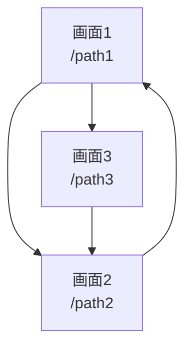

# UI設計

> Status: Draft
> 最終更新: YYYY-MM-DD

本ドキュメントは、システムのUI設計を定義する。

※ UIを持たないプロジェクト（CLI、ライブラリ等）の場合、本ドキュメントは削除可。

---

## 画面一覧

| 画面ID | 画面名 | パス | 説明 |
|--------|--------|------|------|
| S001 | {画面名1} | `/path1` | {説明} |
| S002 | {画面名2} | `/path2` | {説明} |
| S003 | {画面名3} | `/path3` | {説明} |

---

## 画面遷移図

---

## 画面詳細

### S001: {画面名1}

| 項目 | 内容 |
|------|------|
| パス | `/path1` |
| 目的 | {この画面の目的} |
| アクセス権 | {誰がアクセスできるか} |

#### 構成要素

| 要素 | 種別 | 説明 |
|------|------|------|
| {要素1} | ボタン | {説明} |
| {要素2} | フォーム | {説明} |
| {要素3} | リスト | {説明} |

#### ユーザー操作

| 操作 | 結果 |
|------|------|
| {操作1} | {結果・遷移先} |
| {操作2} | {結果・遷移先} |

### S002: {画面名2}

| 項目 | 内容 |
|------|------|
| パス | `/path2` |
| 目的 | {この画面の目的} |
| アクセス権 | {誰がアクセスできるか} |

#### 構成要素

| 要素 | 種別 | 説明 |
|------|------|------|
| {要素1} | {種別} | {説明} |

---

## 共通コンポーネント

| コンポーネント | 説明 | 使用画面 |
|----------------|------|----------|
| ヘッダー | {説明} | 全画面 |
| フッター | {説明} | 全画面 |
| {コンポーネント1} | {説明} | {画面リスト} |

---

## レスポンシブ対応

| ブレークポイント | 幅 | 対応 |
|------------------|-----|------|
| モバイル | ~767px | {対応内容} |
| タブレット | 768px~1023px | {対応内容} |
| デスクトップ | 1024px~ | {対応内容} |

---

## 関連ドキュメント

- [flows.md](./flows.md) - 主要フロー
- [structure.md](../02-architecture/structure.md) - コンポーネント構成
